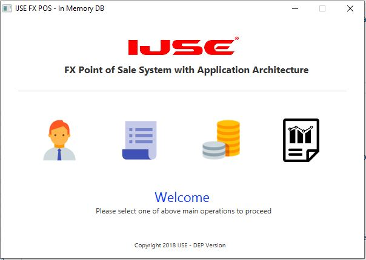
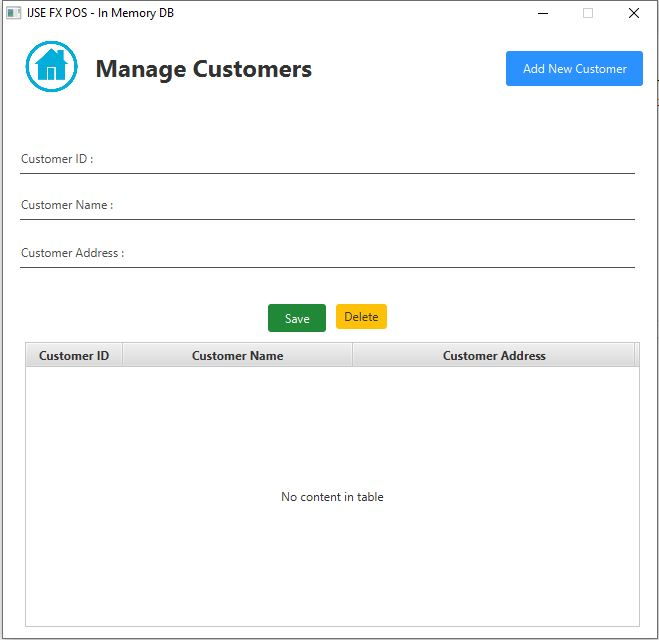
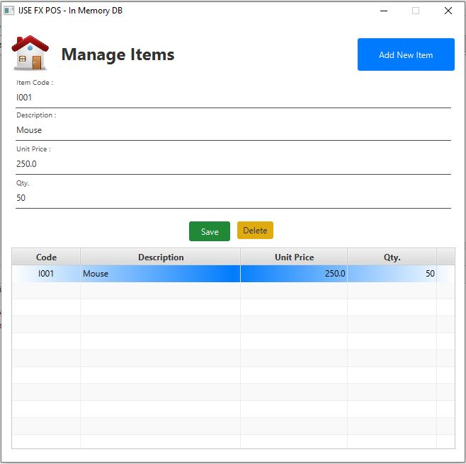
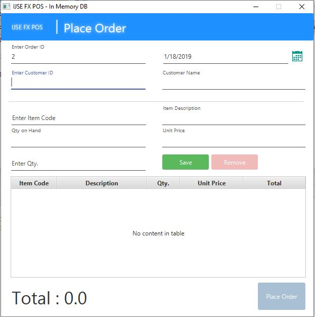
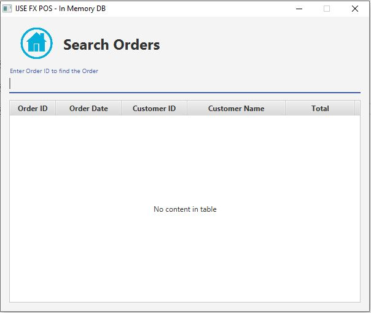

# POS SYSTEM (INBUILD MEMORY) -JAVAFX

In this **POS SYSTEM** has all the fucnctionalities of a pos system, like customer adding,item management,order placing and order viewing. It has inbuild memory.It Consist of four main parts;

    * Manage Customers
    * Manage Items
    * Place orders
    * View Orders
   
## POS SYSTEM Main Menu
 

## Customer Page 
 

## Item Page

## Place Order Page

## Order View Page
 
